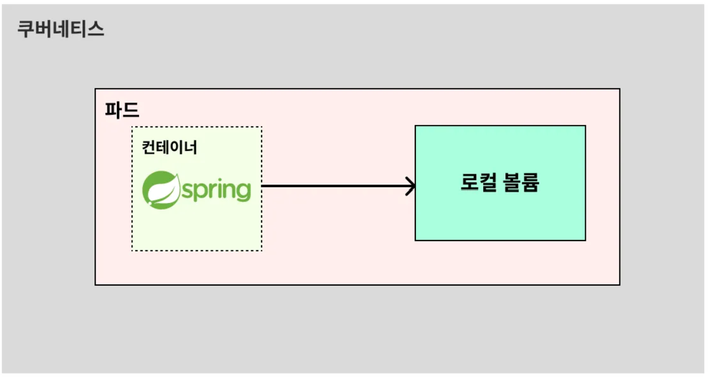
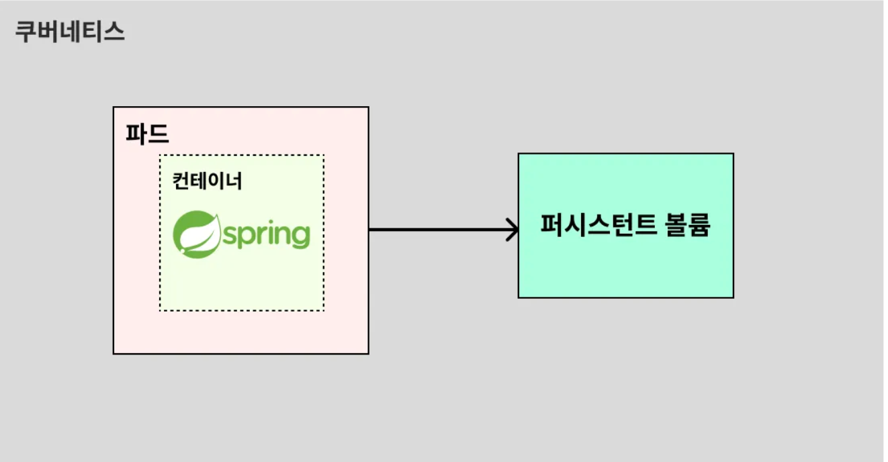
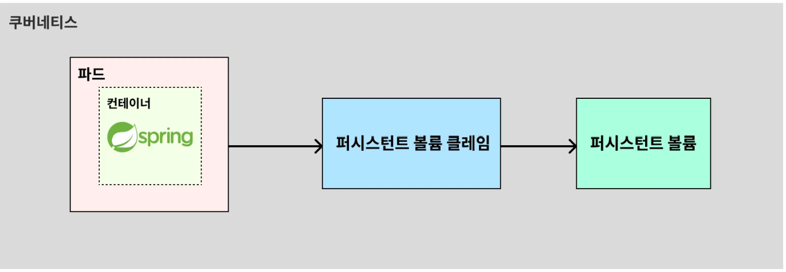
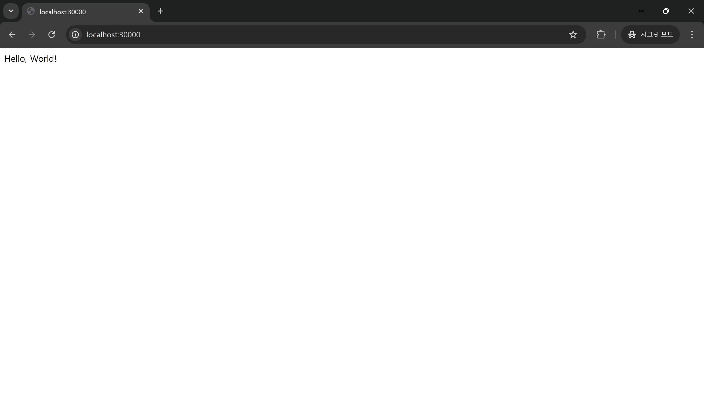
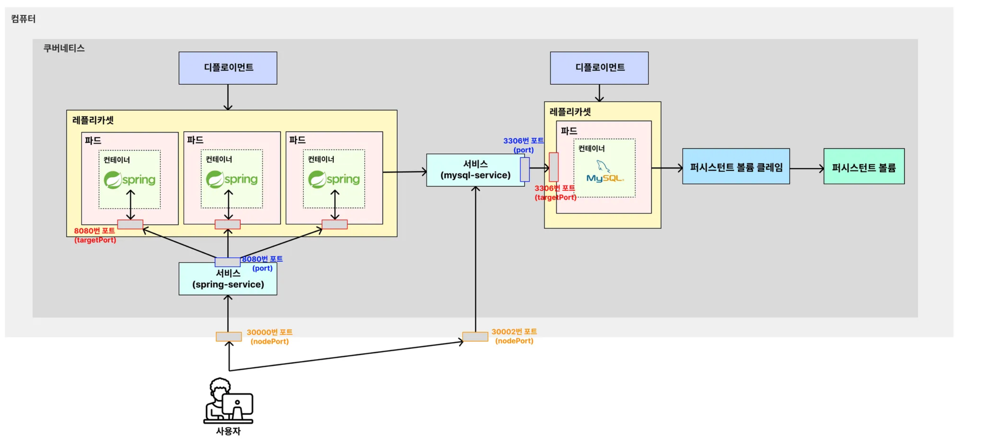

<details>
    <summary><b>2025-03-07</b></summary>

# 쿠버네티스 공부

# 1. 쿠버네티스의 볼륨

- 볼륨(Volume)이란 데이터를 영속적으로 저장하기 위한 방법이다.
- 쿠버네티스에서 볼륨은 크게 2가지로 나뉜다.

## 로컬 볼륨

- 파드 내부의 공간 일부를 볼륨으로 활용하는 방식이다.
- 이 방식은 파드가 삭제되는 즉시 데이터도 함께 삭제된다.
- 그래서 실제로 사용되는 일이 잘 없다.
  

## 퍼시스턴트 볼륨(Persistent Volume, PV)

- 파드 외부의 공간 일부를 볼륨(Volume)으로 활용하는 방식이다.
- 이 방식은 피드가 삭제되는 것과 상관없이 데이터를 영구적으로 사용할 수 있다는 장점이 있다.
- 현업에서는 주로 이 방식을 많이 활용한다.
  

- 하지만 실제로 파드가 퍼시스턴트 볼륨에 직접 연결할 수 없다.
- **퍼시스턴트 볼륨 클레임** 이라는 중개자가 있어야 한다.
  그래서 쿠버네티스 구조에서는 아래와 같은 구조로 퍼시스턴트 볼륨을 연결한다.
  

# 볼륨 이용해서 mysql이랑 spring 띄우기

## 준비물: 이제 막 생성한 spring 프로젝트 2개

### mysql전용 spring

**mysql-deployment.yaml** 메이페스 파일 생성하기

```
apiVersion: apps/v1
kind: Deployment

# Deployment 기본 정보
metadata:
  name: mysql-deployment # Deployment 이름

# Deployment 세부 정보
spec:
  replicas: 1 # 생성할 파드의 복제본 개수
  selector:
    matchLabels:
      app: mysql-db # 아래에서 정의한 Pod 중 'app: backend-app'이라는 값을 가진 파드를 선택

  # 배포할 Pod 정의
  template:
    metadata:
      labels: # 레이블 (= 카테고리)
        app: mysql-db
    spec:
      containers:
        - name: mysql-container # 컨테이너 이름
          image: mysql # 컨테이너를 생성할 때 사용할 이미지
          ports:
            - containerPort: 3306  # 컨테이너에서 사용하는 포트를 명시적으로 표현
          env:
            - name: MYSQL_ROOT_PASSWORD
              valueFrom:
                secretKeyRef:
                  name: mysql-secret
                  key: mysql-root-password
            - name: MYSQL_DATABASE
              valueFrom:
                configMapKeyRef:
                  name: mysql-config
                  key: mysql-database
          # 컨테이너 내에서 어떤 경로를 볼륨으로 사용할 지 지정
          volumeMounts:
	          - name: mysql-persistent-storage # 밑에서 설정할 volumes.name과 값이 같아야 함
	            mountPath: /var/lib/mysql # mysql 컨테이너 내부에 있는 경로
      # 파드가 사용할 볼륨을 지정
      volumes:
	      - name: mysql-persistent-storage # 위에서 설정할 volumeMounts.name과 일치해야 함
	        persistentVolumeClaim:
	          claimName: mysql-pvc # 연결시킬 PVC의 name과 동일해야 함
```

**mysql-secret.yaml**

```
apiVersion: v1
kind: Secret

# Secret 기본 정보
metadata:
  name: mysql-secret # Secret 이름

# Key, Value 형식으로 값 저장
stringData:
  mysql-root-password: password123
```

**mysql-config.yaml**

```
apiVersion: v1
kind: ConfigMap

# ConfigMap 기본 정보
metadata:
  name: mysql-config # ConfigMap 이름

# Key, Value 형식으로 설정값 저장
data:
  mysql-database: kub-practice
```

**mysql-service.yaml**

```
apiVersion: v1
kind: Service

# Service 기본 정보
metadata:
  name: mysql-service # Service 이름

# Service 세부 정보
spec:
  type: NodePort # Service의 종류
  selector:
    app: mysql-db # 실행되고 있는 파드 중 'app: mysql-db'이라는 값을 가진 파드와 서비스를 연결
  ports:
    - protocol: TCP # 서비스에 접속하기 위한 프로토콜
      port: 3306 # 쿠버네티스 내부에서 Service에 접속하기 위한 포트 번호
      targetPort: 3306 # 매핑하기 위한 파드의 포트 번호
      nodePort: 30002 # 외부에서 사용자들이 접근하게 될 포트 번호
```

**mysql-pv.yaml**

```
apiVersion: v1
kind: PersistentVolume

# PersistentVolume 기본 정보
metadata:
  name: mysql-pv # PersistentVolume 이름

# PersistentVolume 세부 정보
spec:
  storageClassName: my-storage # PV와 PVC의 storageClassName이 같다면 볼륨이 연결된다.
  capacity:
    storage: 1Gi # 볼륨이 사용할 용량을 설정
  accessModes:
    - ReadWriteOnce # 아래 hostPath 타입 활용 시 이 옵션만 사용 가능
  hostPath: # hostPath 타입을 활용 (hostPath : 쿠버네티스 내부 공간을 활용)
    path: "/mnt/data" # 쿠버네티스 내부의 공간에서 /mnt/data의 경로를 볼륨으로 사용
```

**mysql-pvc.yaml**

```
apiVersion: v1
kind: PersistentVolumeClaim

# PersistentVolumeClaim 기본 정보
metadata:
  name: mysql-pvc # PersistentVolumeClaim 이름

# PersistentVolumeClaim 세부 정보
spec:
  storageClassName: my-storage # PV와 PVC의 storageClassName이 같다면 볼륨이 연결된다.
  accessModes:
    - ReadWriteOnce # 볼륨에 접근할 때의 권한
  resources: # PVC가 PV에 요청하는 리소스의 양을 정의
    requests: # 필요한 최소 리소스
      storage: 1Gi # PVC가 PV에 요청하는 스토리지 양 (PV가 최소 1Gi 이상은 되어야 한다.)
```

**메니페스트 기반으로 오브젝트 생성하기**

```
$ kubectl apply -f mysql-secret.yaml
$ kubectl apply -f mysql-config.yaml
$ kubectl apply -f mysql-deployment.yaml
$ kubectl apply -f mysql-service.yaml
```

---

## 다른 스프링 프로젝트 파일에서 실행

**테스트용 Controller 작성**

```
@RestController
public class AppController {
  @GetMapping("/")
  public String home() {
    return "Hello, World!";
  }
}
```

**application.yml**

```
spring:
  datasource:
    url: jdbc:mysql://${DB_HOST}:${DB_PORT}/${DB_NAME}
    username: ${DB_USERNAME}
    password: ${DB_PASSWORD}
    driver-class-name: com.mysql.cj.jdbc.Driver
```

**Dockerfile파일 생성**

```
FROM openjdk:21-jdk

COPY build/libs/*SNAPSHOT.jar /app.jar

ENTRYPOINT ["java", "-jar", "/app.jar"]
```

**프로젝트, 이미지 빌드하기**

```
./gradlew clean build
docker build -t spring-server .
```

**spring-deployment.yaml**

```
apiVersion: apps/v1
kind: Deployment

# Deployment 기본 정보
metadata:
  name: spring-deployment # Deployment 이름

# Deployment 세부 정보
spec:
  replicas: 3 # 생성할 파드의 복제본 개수
  selector:
    matchLabels:
      app: backend-app # 아래에서 정의한 Pod 중 'app: backend-app'이라는 값을 가진 파드를 선택

  # 배포할 Pod 정의
  template:
    metadata:
      labels: # 레이블 (= 카테고리)
        app: backend-app
    spec:
      containers:
        - name: spring-container # 컨테이너 이름
          image: spring-server # 컨테이너를 생성할 때 사용할 이미지
          imagePullPolicy: IfNotPresent # 로컬에서 이미지를 먼저 가져온다. 없으면 레지스트리에서 가져온다.
          ports:
            - containerPort: 8080  # 컨테이너에서 사용하는 포트를 명시적으로 표현
          env:
            - name: DB_HOST
              value: mysql-service # Service의 name만 입력하면 다른 서비스와 통신할 수 있다.
            - name: DB_PORT
              value: "3306" # 숫자값을 문자로 인식하게 만들기 위해 쌍따옴표 붙여야 한다.
            - name: DB_NAME
              value: kub-practice
            - name: DB_USERNAME
              value: root
            - name: DB_PASSWORD
              value: password123
```

**spring-service.yaml**

```
apiVersion: v1
kind: Service

# Service 기본 정보
metadata:
  name: spring-service

# Service 세부 정보
spec:
  type: NodePort # Service의 종류
  selector:
    app: backend-app # 실행되고 있는 파드 중 'app: backend-app'이라는 값을 가진 파드와 서비스를 연결
  ports:
    - protocol: TCP # 서비스에 접속하기 위한 프로토콜
      port: 8080 # 쿠버네티스 내부에서 Service에 접속하기 위한 포트 번호
      targetPort: 8080 # 매핑하기 위한 파드의 포트 번호
      nodePort: 30000 # 외부에서 사용자들이 접근하게 될 포트 번호
```

**매니페스트 파일 실행하기**

```
$ kubectl apply -f spring-deployment.yaml
$ kubectl apply -f spring-service.yaml
```

**결과**


**아키텍쳐**


</details>
